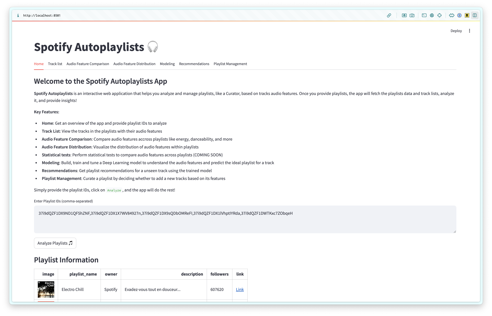
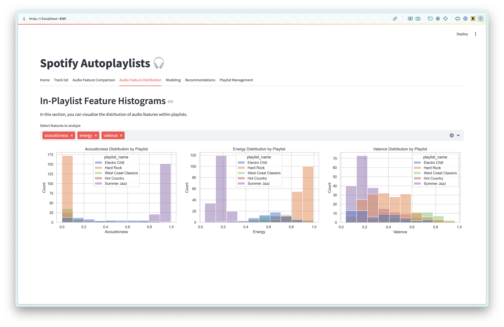
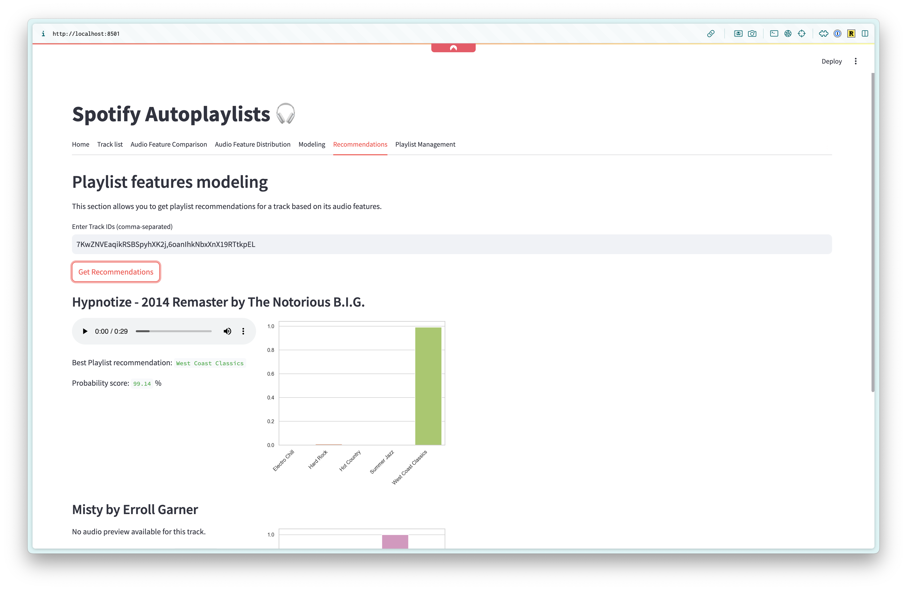

# Spotify Autoplaylists

Spotify Autoplaylists is an interactive web application designed to automatically retrieve, analyze, and curate Spotify playlists based on audio features. This tool allows you to create musical experiences tailored to specific moods, genres, or other preferences by leveraging the power of data and machine learning.



## Features

- Retrieve all tracks from a playlist along with their audio features
- Analyze and compare what audio characteristics (e.g., energy, danceability) differentiate various playlists
- Use AI models to get recommendation for tracks or playlists



## Sections

- **Home**: Overview of the app, and input field for Spotify playlist IDs to analyze
- **Track List**: Displays the tracks from provided playlists including their audio features
- **Audio Feature Comparison**: Compare audio features (e.g., energy, danceability) across different playlists
- **Audio Feature Distribution**: Visualize the distribution of audio features within playlists
- **Statistical tests**: Perform statistical tests to compare audio features across playlists (COMING SOON)
- **Modeling**: Build, train and tune a deep learning model to understand audio features and predict the ideal playlist for a track
- **Recommendations**: Get playlist recommendations for a unseen track using the trained machine learning model
- **Playlist Management**: Curate playlists by deciding whether to add a new tracks based on their audio features


## Get Started
This application is built using **Python** and **Streamlit**.

### Prerequisites

1. **Install Python** and the required dependencies:

   Install the necessary Python packages listed in `requirements.txt`:
   ```
   pip install -r requirements.txt
   ```

2. **Spotify API** Access:

    Create a Spotify API app [here](https://developer.spotify.com/documentation/web-api/tutorials/getting-started#create-an-app) and retrieve your `CLIENT_ID` and `CLIEND_SECRET` 
    
    Create a `.env` file in your project's root directory with the following format:
    ```
    CLIENT_ID=your_client_id_here
    CLIENT_SECRET=your_client_secret_here
    ```

3. Create a **Playlist CSV** File (Optional for Jupyter Notebook): 
   
   If you want to run the exploratory Jupyter notebook, you’ll need to create a CSV file to define the playlists of interest. 
   
   Create a `data/` directory and add a file named `playlists.csv` with the following format:

   - playlist_name: The name of the playlist for easy reference.
   - playlist_id: The Spotify playlist ID, which can be found in the playlist URL.

    Example:

    ```
    playlist_name,playlist_id 
    Electro chill,37i9dQZF1DX9ND1QF5hZNF
    Hard Rock,37i9dQZF1DX1X7WV84927n
    ```



## Running the Application

1. Clone the repository:

```
git clone https://github.com/pauldoan/spotify-autoplaylists.git
```

2. Navigate to the project directory:

```
cd spotify-autoplaylists
```

3. Run the Streamlit application:

```
streamlit run autoplaylists.py
```

4. Open the provided localhost link in your browser to interact with the app.

## Model and Data Requirements

### Data Requirements
The application requires access to Spotify playlists and tracks via the Spotify Web API. Ensure that the playlists you are analyzing have accessible metadata and audio features.

### Model Requirements
The AI-powered playlist recommendations and deep learning model rely on track metadata and audio features, such as:

- Energy
- Danceability
- Valence
- Tempo
- Loudness
- Speechiness

The model is built using the deep learning frameworks PyTorch. You can tune the model further using the `03_modeling.ipynb` notebook to improve its performance in predicting playlist recommendations.

## Contribution Guidelines
Contributions are welcome! Please open an issue to discuss the proposed changes before submitting a pull request. You can also help by reporting bugs or suggesting new features.